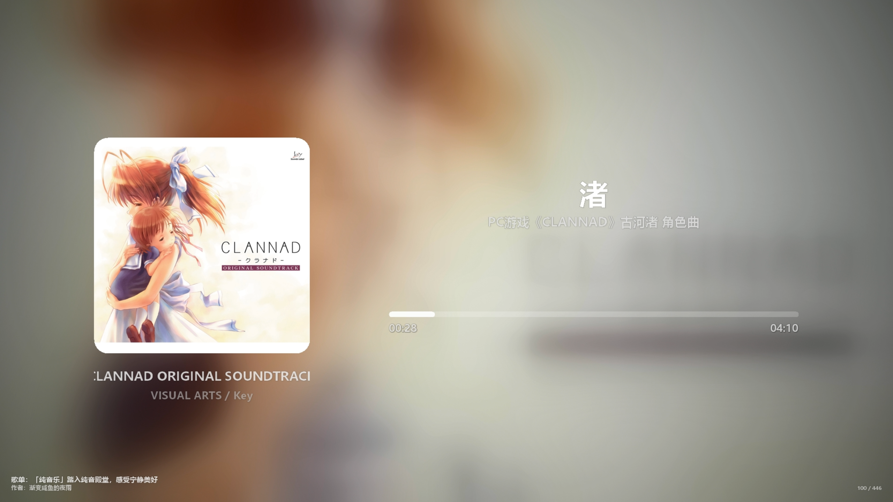
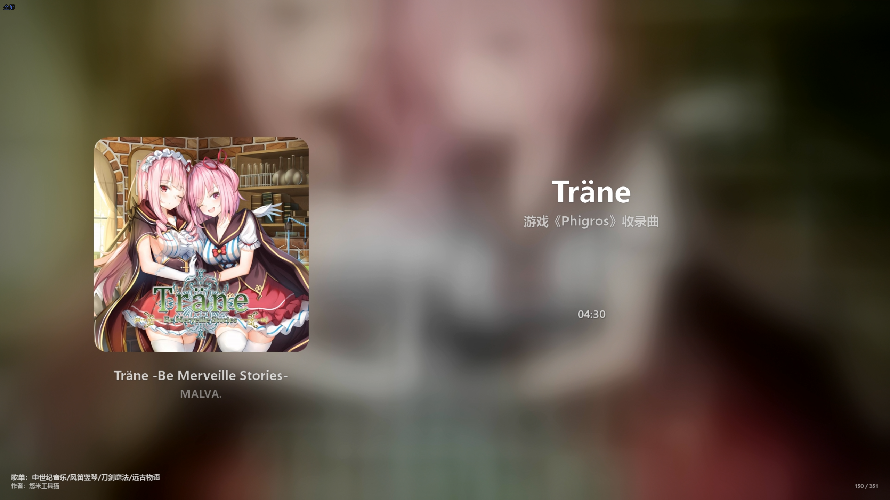

# MusicForUrl

MusicForUrl 可以把网易云音乐或 QQ 音乐的歌单、单曲直接生成为一个 MP4 视频文件。生成完成后，页面先显示服务器上的本地文件路径；如果已经配置 TMPLINK Token，还会继续异步上传并返回临时公开直链。

面向用户的最终生成结果是 **MP4**，不需要再拼接文件，也不会在生成结果中提供本地 HTTP 播放链接。

本仓库 Fork 自 [znc15/MusicForUrl](https://github.com/znc15/MusicForUrl)，并在原项目基础上继续开发 MP4 生成模式、任务队列、生成历史和 TMPLINK 上传等功能。感谢原作者及上游项目贡献者的工作。

> 本项目只提供技术工具。请遵守音乐平台服务条款和所在地版权法律，仅处理你有权访问、生成和分享的内容。TMPLINK 是独立的第三方服务，与本项目没有隶属关系。

## 生成效果展示

下列图片均为本项目实际生成的视频画面。点击图片可以查看原图。

<table>
  <tr>
    <th width="33%">质量模式（原标准模式）</th>
    <th width="33%">平衡模式</th>
    <th width="33%">极速模式</th>
  </tr>
  <tr>
    <td><a href="./doc-img/013.png"></a></td>
    <td><a href="./doc-img/012.png"></a></td>
    <td><a href="./doc-img/011.png"></a></td>
  </tr>
</table>

### 三种模式有什么区别

| 模式 | 帧率 | 歌词 | 进度显示 | 动画与文字 | 适合场景 |
|---|---:|---|---|---|---|
| 质量 | `5/10/15/30 FPS`，默认 `15` | 显示；歌词位移、字号变化有动画过渡 | 完整进度条、当前时间和总时长 | 有首尾淡入淡出；长标题、专辑和歌手可滚动 | 优先保证画面效果 |
| 平衡（默认） | 固定 `1 FPS` | 显示；歌词直接切换位置 | 完整进度条、当前时间和总时长 | 无淡入淡出；长文字用 `...` 截断 | 大幅提速，同时保留歌词和进度 |
| 极速 | 固定 `1 FPS` | 不获取、不显示，统一使用纯音乐布局 | 不显示进度条和当前时间，只显示总时长 | 每首歌只渲染一张最终画面并复用 | 优先追求生成速度 |

三种模式都保留歌曲封面、模糊背景、标题、副标题、专辑、歌手信息；多曲歌单还会在左下角显示歌单名与作者，在右下角持续显示当前曲目序号 `x / y`。单曲不显示歌单归属信息。

## 实际功能

### 音乐平台和输入

- 支持网易云音乐和 QQ 音乐。
- 支持歌单链接、歌单 ID 和单曲链接。
- 支持按歌单顺序生成或随机排序后生成。
- 网易云支持二维码、短信验证码、密码和 Cookie 登录。
- QQ 音乐支持二维码和 Cookie 登录。
- 个人中心可以查看当前账号的歌单、收藏和最近播放记录，并可直接选择歌单开始生成。

### MP4 生成

- 歌单内的全部可播放歌曲会合并成一个 MP4；单曲输入会生成只有一首歌的 MP4。
- 分辨率可选 `1600×900`、`1920×1080`，默认 `1920×1080`。
- 音质可选低、中、高，默认高音质。
- 质量模式可选 `5/10/15/30 FPS`；平衡和极速模式始终固定 `1 FPS`。
- 单个歌单的歌曲处理并发数可选 `2/4/6/8/16`，默认 `4`。
- 首次选择 `8` 或 `16` 并发时会提示资源占用和稳定性风险。
- 自动探测 NVIDIA NVENC、Intel Quick Sync、AMD AMF；不可用时回退到 CPU `libx264`。
- 明确不可播放的歌曲会自动跳过，并在生成结果中列出歌曲名称和原因；其他网络或转码错误仍会使任务失败。

### 歌词和画面布局

- 质量和平衡模式支持同步歌词及双语歌词。
- 歌词中只要出现“纯音乐，请欣赏”，整首歌曲就按无歌词处理。
- 没有有效歌词时，不预留歌词区域，标题、副标题和进度区域会使用居中布局。
- 质量模式会对歌词位置和字号变化进行动画过渡；平衡模式直接切换歌词位置。
- 专辑图片周围不添加弥散阴影。
- 多曲歌单左下角固定显示歌单名和作者，右下角始终显示 `x / y`。
- 极速模式不请求歌词、不显示进度条，每首歌只复用一张静态画面。

### 服务端任务队列

- 每个歌单提交后都会进入服务端生成队列，任何时刻只运行一个歌单生成任务。
- 一个歌单内部可以按所选并发数同时处理多首歌曲，这与“歌单任务单队列”不冲突。
- 浏览器刷新或关闭不会中断任务，重新打开首页后仍能看到任务进度、当前歌曲、已用时间和预计剩余时间。
- 可以继续提交新歌单排队，也可以取消正在运行或尚未开始的任务。
- 排队等待时间不计入生成耗时；计时从任务真正开始处理时计算，到本地 MP4 合并完成时停止。
- 已完成、失败或取消的任务可以点击“确认”从首页任务列表移除；成功任务仍保留在历史生成页面。
- 任务队列保存在 Node.js 进程内：刷新浏览器不受影响，但重启服务会清空运行中和排队任务。已经生成的 MP4 和 SQLite 历史记录不会被删除。

### 本地文件、上传和历史记录

- MP4 生成完成后立即显示本地绝对路径。
- 所有最终视频直接存放在 `data/playlist-mp4/`，不会为每个视频再创建单独子目录。
- 配置有效 TMPLINK Token 后，视频会进入独立的单并发上传队列。
- 上一个任务上传时，下一个普通生成任务可以同时开始；仅上传任务不会占用生成槽。
- 上传进度、远端合并和公开直链解析状态会显示在任务中。
- 历史生成页保存歌单封面、歌单名、作者、生成时间、实际生成耗时、公开链接和本地路径。
- 历史页会异步检测公开链接：HTTP `200` 视为有效，其他响应或访问错误视为无效。
- 预计过期时间按“生成时间 + 7 天”计算，并以“x天x小时后”的形式显示。
- 本地 MP4 仍存在时，可以从历史页点击“重新上传”；该任务只上传，不重新生成视频。

### 安全和数据保存

- 首次打开站点时可以创建至少 8 位的站点访问密码，也可以使用 `SITE_PASSWORD` 预设。
- 用户设置的站点访问密码只保存 scrypt 加盐哈希。
- 音乐平台 Cookie 和 TMPLINK Token 使用 `ENCRYPTION_KEY` 加密后保存到 SQLite。
- TMPLINK Token 必须先通过 TMPLINK 服务器验证，验证成功后才会保存。
- TMPLINK Token 按网易云账号和 QQ 音乐账号分别配置，服务端不会把明文 Token 返回给浏览器。

## 输出参数和文件命名

### 音质

| 选项 | 网易云请求音质 | QQ 音乐请求档位 | MP4 音频码率 |
|---|---:|---:|---:|
| 低 | 约 128 kbps | M500 | 96 kbps |
| 中 | 约 192 kbps | M800 | 128 kbps |
| 高（默认） | 约 320 kbps | M800 | 192 kbps |

平台实际返回的源音质仍取决于账号权限、歌曲可用档位和平台接口结果。QQ 音乐当前的中、高选项都请求 M800，但最终 MP4 使用不同的 AAC 输出码率。

### 文件名

```text
歌单名_高/中/低_质量/平衡/极速_AAAAxBBBB_XFPS.mp4
```

例如：

```text
我的歌单_高_极速_1920x1080_1FPS.mp4
我的歌单_高_平衡_1920x1080_1FPS.mp4
我的歌单_中_质量_1600x900_15FPS.mp4
```

## 快速开始

### 环境要求

- Node.js `18`～`22`，推荐 Node.js 22 LTS。
- npm。
- FFmpeg，并确保 `ffmpeg` 命令可以从 `PATH` 访问。
- 建议安装可显示中文的字体；Docker 镜像已经安装 Noto CJK。

### Linux / macOS

```bash
git clone https://github.com/Jurangren/MusicForUrl.git
cd MusicForUrl
npm install
cp env.example .env
npm start
```

### Windows

可以直接双击或在 PowerShell 中运行：

```powershell
.\start-windows.bat
```

该脚本会使用项目验证过的 Node.js 22 运行时，检查 FFmpeg，并在需要时安装或修复依赖。

也可以手动执行：

```powershell
npm install
Copy-Item env.example .env
npm start
```

启动后打开 [http://localhost:3000](http://localhost:3000)。首次访问且没有设置 `SITE_PASSWORD` 时，页面会引导创建站点访问密码。

常用命令：

```bash
npm run dev       # 监听后端文件变化
npm run check     # JavaScript 语法检查
npm test          # 运行自动化测试
```

启动时如果 `.env` 不存在，程序会从 `env.example` 自动创建；模板以后增加的配置键也会自动补到现有 `.env` 末尾。

## Docker 部署

1. 打开 `deploy/docker-compose.yml`。
2. 把示例 `ENCRYPTION_KEY` 改成至少 16 位、建议 32 位以上的随机字符串。
3. 构建并启动：

```bash
docker compose -f deploy/docker-compose.yml up -d --build
docker compose -f deploy/docker-compose.yml logs -f
```

默认端口为 `3000`，数据保存在 named volume `music-for-url-data`。如果希望直接写入宿主机目录，可以把 compose 中的 volume 改为：

```yaml
volumes:
  - ../data:/app/data
```

仓库还提供 `1c1g`、`2c4g`、`4c4g` 和 `8c8g` 四套资源预设。例如：

```bash
docker compose -f deploy/docker-compose.4c4g.yml --compatibility up -d --build
```

这些预设会限制 Node.js 内存、歌曲处理并发、FFmpeg 线程和缓存容量。界面仍允许选择较高并发，但实际不会突破服务端上限。低配机器建议选择 `2` 或 `4`；`8/16` 可能造成 CPU、显存、内存、磁盘或网络拥塞。

不要随意执行 `docker compose down -v`，它会删除 named volume 中的数据库、生成视频和缓存。

### 国内或受限网络构建

```bash
docker compose -f deploy/docker-compose.yml build \
  --build-arg ALPINE_REPO_MIRROR=mirrors.aliyun.com/alpine \
  --build-arg NPM_REGISTRY=https://registry.npmmirror.com
```

## TMPLINK 公开链接

TMPLINK 是第三方临时文件分享平台。MusicForUrl 始终先在本地生成 MP4；没有配置 Token 或上传失败时，本地文件仍然保留。

### 获取 Token

个人中心的“公开链接上传（TMPLINK）”区域提供“怎么获取 Token？”弹窗，也可以按下面步骤操作：

1. 打开 [TMPLINK](https://www.ttttt.link) 并注册或登录。
2. 登录后按 `F12` 打开浏览器开发者工具。
3. 进入“应用（Application）”页面。
4. 展开 `Local Storage`，选择 `https://www.ttttt.link`。
5. 找到 `app_token`，复制完整 Value。
6. 回到 MusicForUrl 个人中心，粘贴后点击“验证并保存”。

Token 相当于账号凭证，请勿截图、转发、写入 README、提交到 Git 或放入公开日志。怀疑泄露时应立即在 TMPLINK 退出登录或刷新凭证，并在个人中心移除旧 Token。

## 数据目录

```text
data/database.sqlite       # 用户、收藏、历史记录和加密凭证
data/playlist-mp4/*.mp4    # 最终生成的 MP4，直接平铺存放
data/cache/                # 内部歌曲渲染缓存
data/temp/                 # 生成过程中的临时文件
data/site-access.json      # 站点访问密码的盐和哈希
data/.encryption_key       # 开发环境自动生成的加密密钥
```

生成过程会使用内部临时分片和缓存来支持歌曲并发、失败恢复及最终合并，但这些不是提供给用户的输出格式；用户最终得到的仍然是单个 MP4 文件。

`data/`、`.env`、数据库、日志、临时文件和本地 TMPLINK 测试脚本都不应提交到 Git。部署和迁移时请同时备份 `data/` 与 `ENCRYPTION_KEY`；密钥丢失或变化后，已经保存的 Cookie 和 TMPLINK Token 将无法解密。

## 常用配置

完整环境变量模板见 `env.example`。常用项目如下：

| 环境变量 | 默认值 | 用途 |
|---|---:|---|
| `PORT` | `3000` | HTTP 服务端口 |
| `NODE_ENV` | `development` | 生产环境设为 `production` |
| `ENCRYPTION_KEY` | 开发环境自动生成 | Cookie 和 TMPLINK Token 加密密钥；生产环境必须设置 |
| `SITE_PASSWORD` | 首次访问创建 | 可选的站点访问密码 |
| `CACHE_TTL` | `86400` | 歌单元数据缓存时间，单位秒 |
| `TOKEN_TTL_HOURS` | `168` | 音乐账号登录状态有效期，单位小时 |
| `VIDEO_ENCODER` | `auto` | `auto/nvenc/qsv/amf/cpu` |
| `VIDEO_FONT_FILE` | 自动检测 | FFmpeg 使用的字体文件绝对路径 |
| `VIDEO_TRANSITION_SECONDS` | `0.8` | 质量模式首尾淡入淡出秒数 |
| `TMPLINK_SLICE_SIZE_MIB` | `80` | TMPLINK 上传分片大小，范围 1～80 MiB |
| `TRUST_PROXY` | `loopback` | 反向代理层数、IP 或子网 |

`env.example` 中部分内部生成参数仍沿用 `HLS_` 前缀，这是历史命名，只用于歌曲下载、FFmpeg 渲染、临时分片缓存和资源限制，并不表示项目会把 HLS/M3U8 作为生成结果提供给用户。

## 反向代理

公网部署建议使用 HTTPS。Nginx 示例：

```nginx
server {
    listen 443 ssl;
    server_name music.example.com;

    # ssl_certificate /path/to/fullchain.pem;
    # ssl_certificate_key /path/to/privkey.pem;

    location / {
        proxy_pass http://127.0.0.1:3000;
        proxy_http_version 1.1;
        proxy_set_header Host $host;
        proxy_set_header X-Real-IP $remote_addr;
        proxy_set_header X-Forwarded-For $proxy_add_x_forwarded_for;
        proxy_set_header X-Forwarded-Proto $scheme;
    }
}
```

对应配置：

```dotenv
TRUST_PROXY=1
```

经过 Cloudflare 和 Nginx 等多层代理时，请按照实际拓扑设置代理层数或可信 IP/子网，不要把 `TRUST_PROXY` 设置得比实际范围更宽。

## 常见问题

### 最终会生成什么文件？

最终结果是一个完整 MP4。歌单会合并为一个 MP4，单曲会生成单曲 MP4。页面显示本地文件系统路径；配置 TMPLINK 后还会显示第三方临时公开直链，不再提供本地 HTTP 地址。

### 生成任务一直为 0% 或立即失败

依次检查：

1. 当前音乐平台账号是否仍处于登录状态。
2. 输入是否属于当前选择的平台，链接或 ID 是否有效。
3. `ffmpeg -version` 是否能正常运行。
4. `data/` 是否可写，磁盘是否有足够空间。
5. `ENCRYPTION_KEY` 是否被修改或遗失。
6. 服务日志中第一条与该任务相关的错误。

Docker 可以使用：

```bash
docker compose -f deploy/docker-compose.yml logs --tail=300 -f
```

### 某些歌曲不可播放

程序只会跳过已经明确确认不可播放的歌曲，例如歌曲下架、地区限制、账号权限不足或平台没有返回可用地址。普通网络故障和转码错误不会被误判为不可播放歌曲。

### 选择 8/16 并发反而更慢或不稳定

并发会同时增加音频下载、FFmpeg、CPU、显存、内存和磁盘压力。超过机器可用资源后会出现争抢，生成反而可能变慢。建议先使用默认值 `4`，再根据资源占用逐步调整。

### 配置了硬件编码但仍使用 CPU

`VIDEO_ENCODER=auto` 会执行一次真实编码探测。驱动、FFmpeg 编译选项、设备映射或容器权限不满足时，会自动回退到 `libx264`。Docker 默认配置不保证宿主机 GPU 已经透传。

### 视频生成成功但没有公开链接

本地生成和 TMPLINK 上传是两个独立阶段。请检查个人中心是否保存了当前音乐账号对应的 Token、Token 是否过期、服务器能否访问 TMPLINK，以及本地文件是否还存在。修复后可以从历史生成页点击“重新上传”。

### 刷新后任务还在，但重启服务后任务消失

这是当前设计。活动队列保存在 Node.js 进程内，因此浏览器刷新不影响任务，但服务进程重启会清空活动队列。已经生成的 MP4 和 SQLite 历史记录不受影响。

## 项目结构

```text
MusicForUrl/
├─ deploy/                  # Dockerfile 和不同资源规格的 compose 文件
├─ doc-img/                 # README 成果展示图
├─ lib/                     # 平台接入、数据库、队列、歌词、上传和视频工具
├─ public/                  # 前端页面、样式和浏览器脚本
├─ routes/                  # 登录、歌单、生成、历史和上传接口
├─ tests/                   # Node.js 自动化测试
├─ env.example              # 环境变量模板
├─ server.js                # Express 服务入口
└─ start-windows.bat        # Windows 启动脚本
```

`/health` 是无需音乐账号登录的健康检查接口。其他 `/api/*` 路由属于应用内部接口，不承诺作为第三方 API 长期兼容。

## 安全建议

- 生产环境必须设置独立、随机且稳定的 `ENCRYPTION_KEY`。
- 使用 HTTPS，避免音乐 Cookie、站点密码和 Token 在网络中明文传输。
- 不要把 `.env`、`data/`、数据库、日志或 TMPLINK Token 提交到 Git。
- 定期备份数据库和生成文件，并限制 `data/` 的文件系统访问权限。
- 公开链接有时效但仍是可访问资源，不要用于分发敏感或未获授权的内容。

## License

[MIT](LICENSE)

## 友情链接

[TMPLINK](https://www.ttttt.link)
